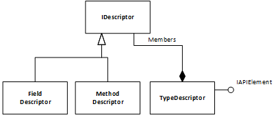

# DesktopSearch

Supports searching of documents and code using ElasticSearch.

## Setup

**Starting ElasticSearch from docker:**\

```bash
docker run -p 9200:9200 -d elasticsearch:withmapper
```

### Kibana

### Marvel

Add to ```ElasticSearch.yml``` to allow creation on marvel indices:

```yml
# [MP]
# turn on auto index creation for marvel
action.auto_create_index: .marvel-*
```

### Sense

```bin\kibana plugin --install elastic/sense```

Open Sense:\
```http://localhost:5601/app/sense```

## ElasticSearch

**Dumping all stored documents:**\
<http://localhost:9200/codesearch/_search?pretty=true&q=*:*>

**Simple Filtering**\
<http://localhost:9200/codesearch/_search?pretty=true&q=firstname:mar*>

- fieldname must be lowercase!
- fieldname can be omitted, then all fields are searched

**Using Mapper Plugin**\
Responsible for extracting content from attachments and indexing it.

See for details:
<https://github.com/elastic/elasticsearch-mapper-attachments>

*Installation:*\

```bin/plugin install elasticsearch/elasticsearch-mapper-attachments/3.1.2```

### Key Aspects

1. Use custom mapping configuration

    ```c#
    var indexDescriptor = new CreateIndexDescriptor(indexName);

                indexDescriptor.Mappings(mp => mp.Map<DocDescriptor>(m => m
                    .AutoMap()
                    .Properties(ps => ps
                            .String(s => s
                                .Name(f => f.Path)
                                .Index(FieldIndexOption.Analyzed)
                                .Store(true))
                    .Attachment(atm => atm
                            .Name(p => p.Content)
                            .FileField(f => f
                                    .Name(p => p.Content)
                                    .Index(FieldIndexOption.Analyzed)
                                    .Store(true)
                                    .TermVector(TermVectorOption.WithPositionsOffsets))))));

    ```

1. Base64 encode content of file to be indexed

    ```c#
    new DocDescriptor()
    {
        Path = "normal text file",
        Content = Convert.ToBase64String(File.ReadAllBytes(@"<some file>")),
    }
    ```

1. searching

```c#

var searchResults = elastic.Search<DocDescriptor>(x => x.Query(q => q.QueryString(q2 => q2.Query("telefon"))));

```

## Using Repl over ElasticSearch

Not working under the hood, because JSON parser tries to load additional dependencies, which it cannot find.

```c#

#r "C:\Users\Mario\.nuget\packages\Newtonsoft.Json\9.0.1\lib\netstandard1.0\Newtonsoft.Json.dll"
#r "C:\Users\Mario\.nuget\packages\Elasticsearch.Net\2.4.2\lib\net46\Elasticsearch.Net.dll"
#r "C:\Users\Mario\.nuget\packages\NEST\2.4.2\lib\net46\Nest.dll" 

using Nest;
var settings = new ConnectionSettings(new Uri("http://localhost:9200"));
settings.DefaultIndex("codesearch");

var elastic = new ElasticClient(settings);

```

## Assemblies


## DataModel



## References

[see References](References.md)

## .net Versions & Compatibility

In order to allow referencing Core data contracts from as many framework versions as possible, 
functionality is restricted to core interactions with ElasticSearch only.

See ```project.json``` of ```DesktopSearch.Core.dll```. It specifies support for .net 4.6 and .net core.

* [How to reference .net core assembly from full .net](http://stackoverflow.com/questions/33810504/reference-a-net-core-library-in-a-net-4-6-project) 
* [Reference Information regarding different .net versions](https://github.com/dotnet/corefx/blob/master/Documentation/architecture/net-platform-standard.md)